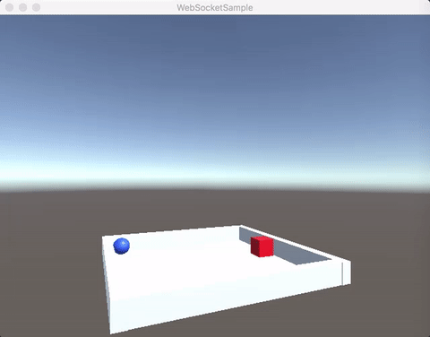

WebSocketSample
===============

WebSocketSample for Unity

## Demo

WebSocketサーバーを使って自分と他プレイヤーの位置を同期するサンプル
青が自分, 赤が他プレイヤー



## Build

* クライアント
Unityで実行

* サーバー
  - Debug
  ```
  xbuild WebSocketServer.sln
  ```
  - Release
  ```
  xbuild /p:Configuration=Release WebSocketServer.sln
  ```

## Run

* サーバー
```
cd Server/bin/Release
mono Server.exe
```
